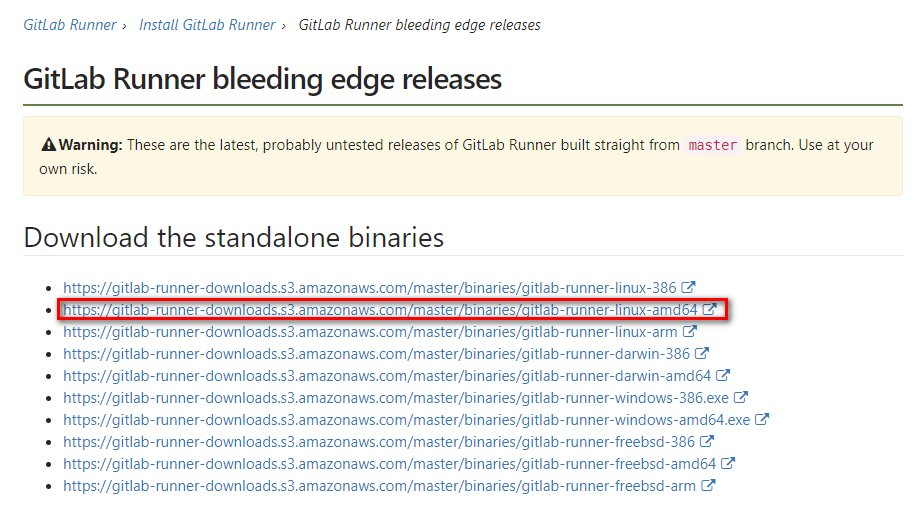

03持续集成和部署
===

服务的持续集成和部署这里有两套选择方案：
* **Gitlab Runner**
* **Jenkins**

## Gitlab Runner
此处采用Gitlab Runner进行`CI/CD`。


官方文档：[https://about.gitlab.com/features/gitlab-ci-cd/](https://about.gitlab.com/features/gitlab-ci-cd/)

在node02节点上安装Gitlab Runner，首先下载Runner程序，这个程序是由go开发，所以部署很方便，就一个二进制可执行程序。

下载地址：[https://docs.gitlab.com/runner/install/bleeding-edge.html](https://docs.gitlab.com/runner/install/bleeding-edge.html)



根据自己服务器的架构版本来选择二进制的可执行程序下载。

最终shell脚本如下：

```shell
wget -O /usr/local/bin/gitlab-runner https://gitlab-runner-downloads.s3.amazonaws.com/master/binaries/gitlab-runner-linux-amd64 && \
chmod +x gitlab-runner && \
useradd --comment 'GitLab Runner' --create-home gitlab-runner --shell /bin/bash && \
gitlab-runner install --user=gitlab-runner --working-directory=/home/gitlab-runner && \
gitlab-runner start
```
那么Runner部署就完成了，接下来配置Runner：

在`Gitlab > 项目 > setting > Runners settings`

在这个页面上有详细的Runner介绍


按照说明进行配置，这里整理成了一个shell脚本：

**Shell构建**
```shell
gitlab-runner register

Please enter the gitlab-ci coordinator URL (e.g. https://gitlab.com )
你的域名

Please enter the gitlab-ci token for this runner
对应的token

Please enter the gitlab-ci description for this runner
描述

Please enter the gitlab-ci tags for this runner (comma separated):
标签

Whether to run untagged jobs [true/false]:
[false]: true

Whether to lock Runner to current project [true/false]:
[true]: true

Please enter the executor: ssh, docker+machine, docker-ssh+machine, kubernetes, docker, parallels, virtualbox, docker-ssh, shell:
shell
```

**Docker构建**
```shell
gitlab-runner register \
  --url "https://gitlab.example.com/" \
  --registration-token "PROJECT_REGISTRATION_TOKEN" \
  --description "docker-ruby-2.1" \
  --executor "shell"
```

如上配置完成后，在gitlab项目setting中即可看到运行中的Runner。

	注：此处最后异步选择执行方式为shell，选择shell是为了方便初次使用CI部署，了解配置脚本，后期会使用docker执行执行