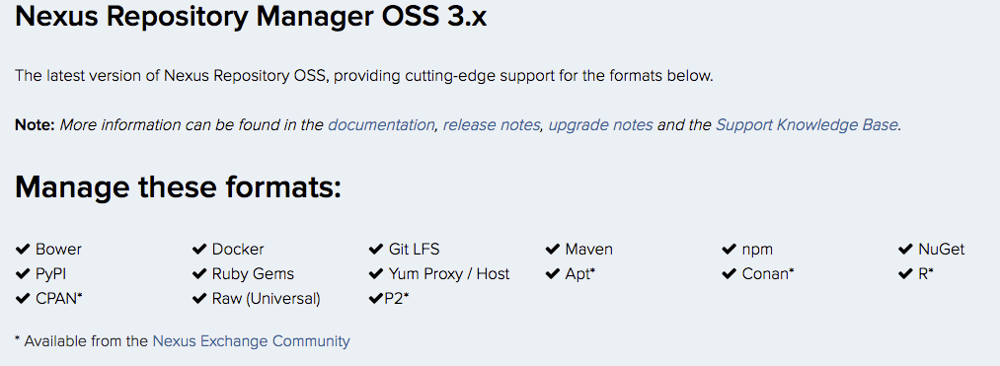
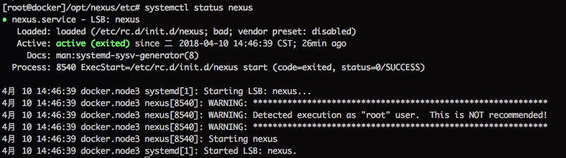

06Nexus仓储
===

Nexus仓储官网简介：
> The world's first and only universal repository solution that's FREE to use. 

[官方文档](https://help.sonatype.com/repomanager3)

**2018-04-10_2.06.png**



从上图可以看到，目前Repository3支持主流的`Maven、npm、Nuget、Docker、PyPl、Bower`，由此可见，仓库的功能全面且强大。

## 安装方法

* 官方二进制分发包安装
* docker镜像

### 官方二进制分发包安装

下载源代码

```shell
curl -# -O http://download.sonatype.com/nexus/3/latest-unix.tar.gz && \
tar -zxvf latest-unix.tar.gz && \
mv nexus-3.10.0-04 /opt
```

目录说明

```shell
nexus
├── bin             # 该目录包含nexus启动脚本本身以及启动相关的配置文件
├── deploy          
├── etc             # 该目录包含配置文件
├── lib             # 该目录包含与Apache Karaf相关的二进制库
├── LICENSE.txt     
├── NOTICE.txt      
├── public          # 该目录包含应用程序的公共资源
└── system          # 该目录包含构成应用程序的所有组件和插件
```

安装Java运行时

```shell
yum install java-1.8.0-openjdk.x86_64 -y && \
java -version
```

配置环境

在 .bashrc 中加入变量

```shell
export NEXUS_HOME="/opt/nexus"
```

创建软连

```shell
ln -s $NEXUS_HOME/bin/nexus /etc/init.d/nexus
```

chkconfig

```shell
cd /etc/init.d && \
chkconfig --add nexus && \
chkconfig --levels 345 nexus on && \
systemctl start nexus.service
```



创建开机启动

```shell
sudo cat>/usr/lib/systemd/system/nexus.service<<EOF
[Unit]  
Description=nexus  
After=network.target  
  
[Service]  
Type=forking  
ExecStart=/opt/nexus/bin/nexus/bin/nexus start  
ExecReload=/opt/nexus/bin/nexus/bin/nexus stop  
ExecStop=/opt/nexus/bin/nexus/bin/nexus stop  
PrivateTmp=true  
  
[Install]    
WantedBy=multi-user.target  
EOF && \
systemctl enbale nexus
```

### 其他备注

服务启动后，默认端口号：`8081`，可以通过修改`/opt/nexus/etc/nexus-default.properties`进行配置.

```shell
http://***:8081/
```

默认登录账号密码`admin/admin123`

### 防火墙

开放默认的`8081`端口

```shell
firewall-cmd --permanent --add-port=8081/tcp && \
firewall-cmd --reload
```

检查以开放的端口

```shell
firewall-cmd --zone=public --list-ports
```