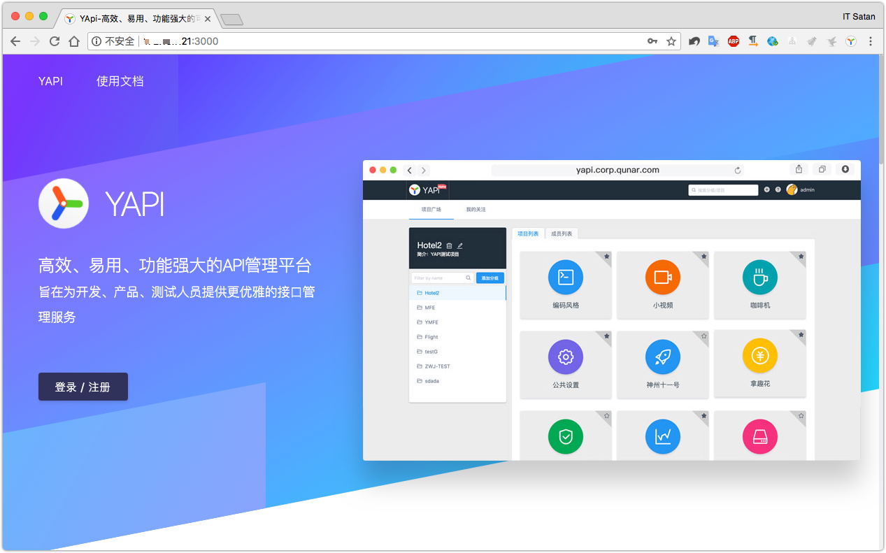

YAPI
===

## 简介

> YApi 是一个可本地部署的、打通前后端及QA的、可视化的接口管理平台<https://yapi.ymfe.org>

## 安装

这里使用Docker的方式来快速创建文档服务：

### 1、创建 MongoDB 数据卷

```shell
docker volume create mongo_data_yapi
```

### 2、启动 MongoDB

```shell
docker run -d --name mongo-yapi -v mongo_data_yapi:/data/db mongo
```

### 3、获取 Yapi 镜像，版本信息可在  查看

```shell
docker pull registry.cn-hangzhou.aliyuncs.com/anoy/yapi
```

### 4、初始化 Yapi 数据库索引及管理员账号

```shell
docker run -it --rm \
  --link mongo-yapi:mongo \
  --entrypoint npm \
  --workdir /api/vendors \
  registry.cn-hangzhou.aliyuncs.com/anoy/yapi \
  run install-server
```

### 5、启动 Yapi 服务

```shell
docker run -d \
  --name yapi \
  --link mongo-yapi:mongo \
  --workdir /api/vendors \
  -p 3000:3000 \
  registry.cn-hangzhou.aliyuncs.com/anoy/yapi \
  server/app.js
```

访问地址 http://localhost:3000

