快速创建Dubbo基架
===

使用`Maven`来构建项目：

## 先创建一个空白的父包

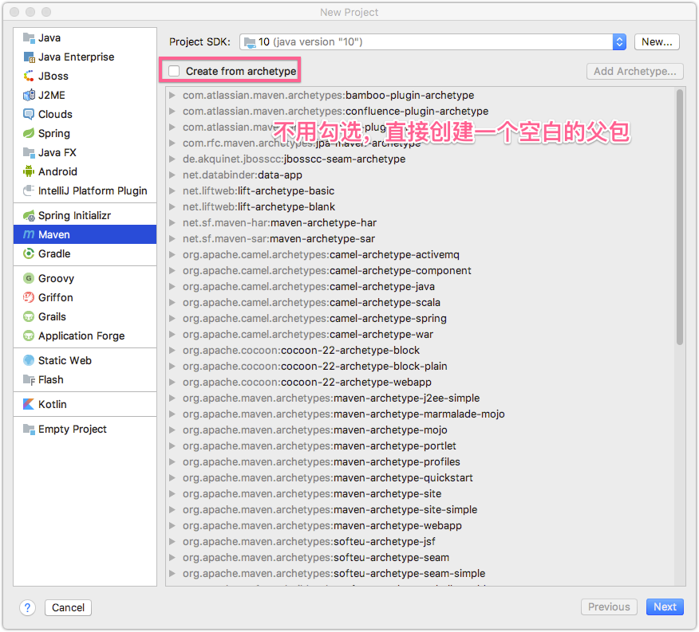

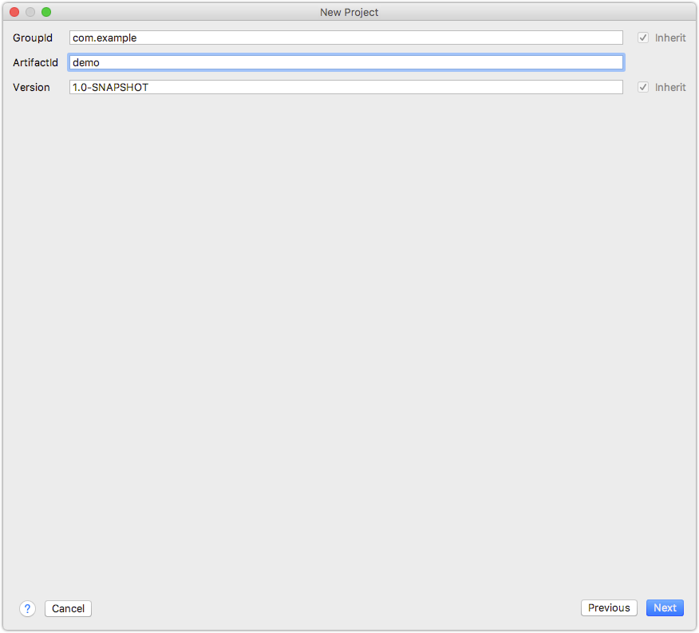

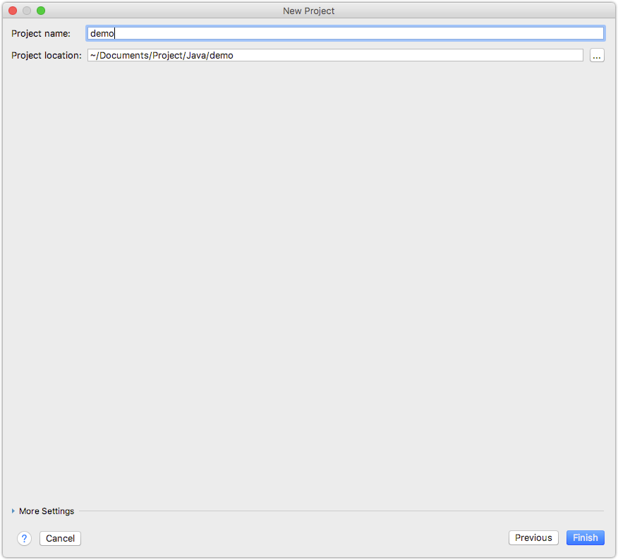

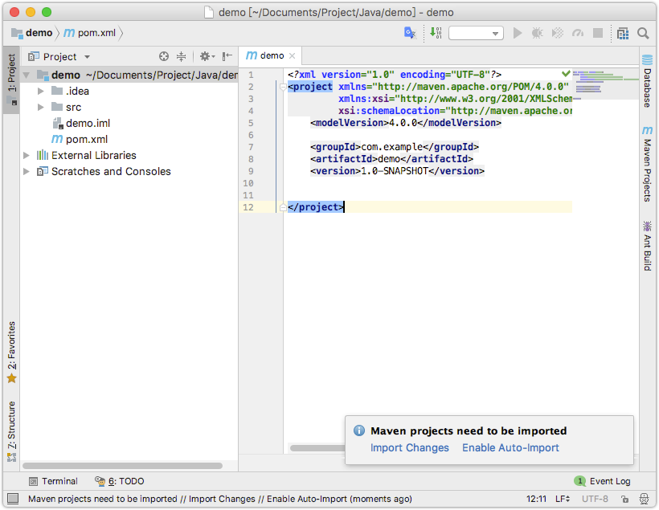

删除多余的`src`目录

## 创建子模块

### 创建管理API接口的module

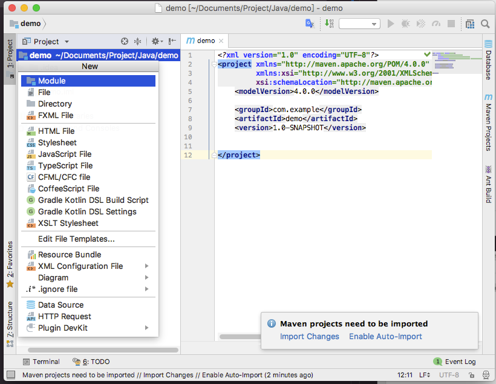

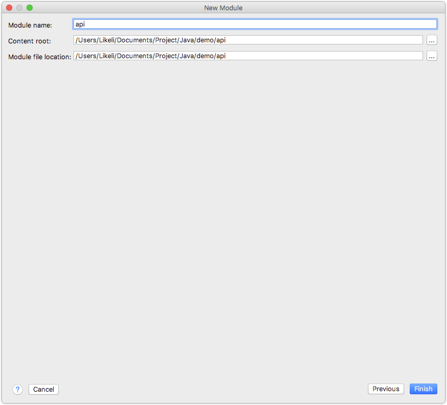

> 同样采用空白的模板，重复上面的步骤

### 创建服务提供者module

> 同样采用空白的模板，重复上面的步骤

创建后的结构如下：

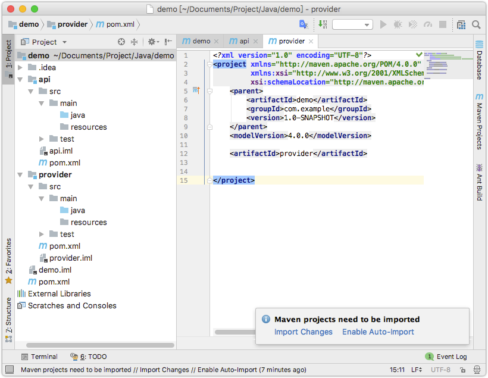

## 配置

### 1. 在父模块引入dubbo

修改父模块的`pom.xml`文件，增加如下部分:

```xml
<parent>
    <groupId>com.alibaba</groupId>
    <artifactId>dubbo-parent</artifactId>
    <version>2.6.1</version>
</parent>

<dependencyManagement>
    <dependencies>
        <dependency>
            <groupId>com.alibaba</groupId>
            <artifactId>dubbo-bom</artifactId>
            <version>2.6.1</version>
            <type>pom</type>
            <scope>import</scope>
        </dependency>
    </dependencies>
</dependencyManagement>
```

完整的配置如下：

```xml
<?xml version="1.0" encoding="UTF-8"?>
<project xmlns="http://maven.apache.org/POM/4.0.0"
         xmlns:xsi="http://www.w3.org/2001/XMLSchema-instance"
         xsi:schemaLocation="http://maven.apache.org/POM/4.0.0 http://maven.apache.org/xsd/maven-4.0.0.xsd">
    <modelVersion>4.0.0</modelVersion>
    <parent>
        <groupId>com.alibaba</groupId>
        <artifactId>dubbo-parent</artifactId>
        <version>2.6.1</version>
    </parent>
    <groupId>com.example</groupId>
    <artifactId>demo</artifactId>
    <packaging>pom</packaging>
    <version>1.0-SNAPSHOT</version>
    <modules>
        <module>api</module>
        <module>provider</module>
    </modules>


    <dependencyManagement>
        <dependencies>
            <dependency>
                <groupId>com.alibaba</groupId>
                <artifactId>dubbo-bom</artifactId>
                <version>2.6.1</version>
                <type>pom</type>
                <scope>import</scope>
            </dependency>
        </dependencies>
    </dependencyManagement>

    <build>
        <pluginManagement>
            <plugins>
                <plugin>
                    <artifactId>maven-clean-plugin</artifactId>
                    <version>3.0.0</version>
                </plugin>
                <plugin>
                    <artifactId>maven-compiler-plugin</artifactId>
                    <version>3.7.0</version>
                </plugin>
                <plugin>
                    <artifactId>maven-install-plugin</artifactId>
                    <version>2.5.2</version>
                </plugin>
                <plugin>
                    <artifactId>maven-deploy-plugin</artifactId>
                    <version>2.8.2</version>
                </plugin>
            </plugins>
        </pluginManagement>
    </build>
    
</project>
```

### 2. API模块中添加一个简单的接口

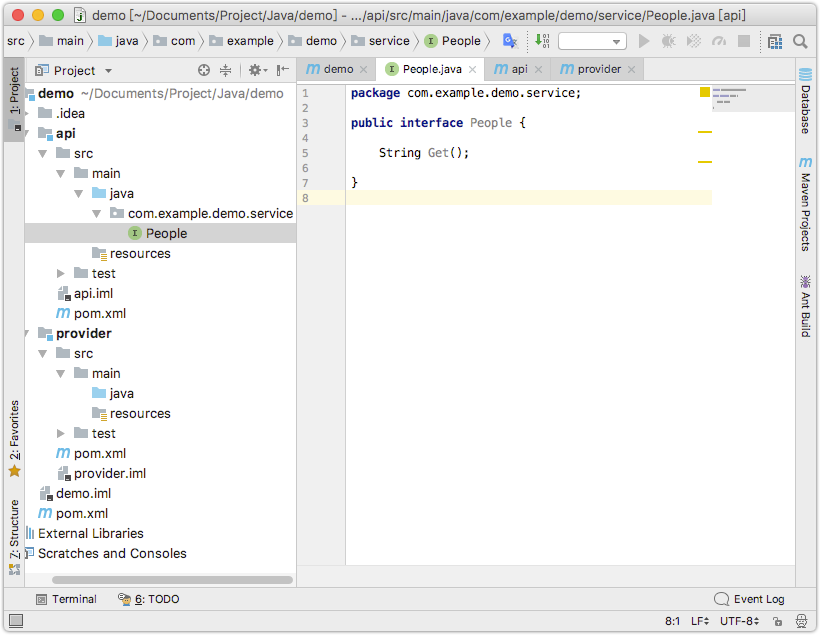

```java
package com.example.demo.service;

public interface People {

    String Get();

}
```

### 3. 调整provider模块的`pom.xml`配置

首先，此模块依赖api模块，需要用到api模块定义好的接口，所以，加入api模块的引用，按`Controle+N (Mac系统)`快捷键导入模块

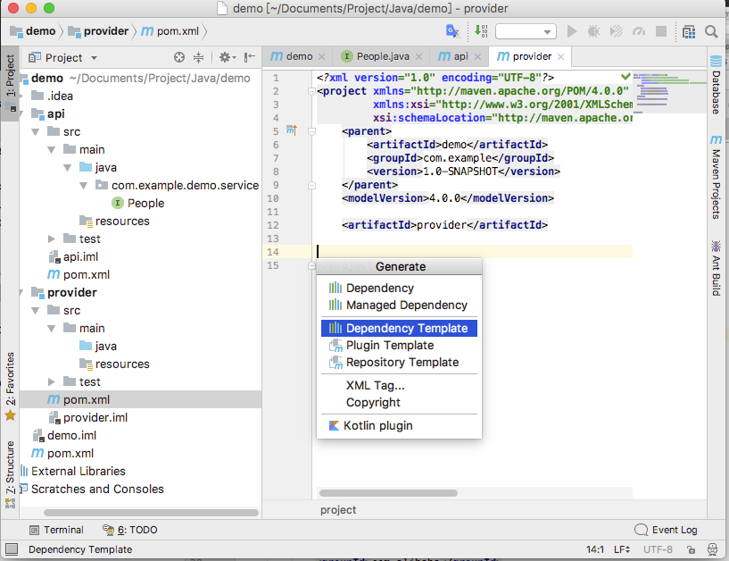

导入api模块后，还需要导入一些dubbo的模块，最终完成如下图：


最终配置代码：

```xml
<?xml version="1.0" encoding="UTF-8"?>
<project xmlns="http://maven.apache.org/POM/4.0.0"
         xmlns:xsi="http://www.w3.org/2001/XMLSchema-instance"
         xsi:schemaLocation="http://maven.apache.org/POM/4.0.0 http://maven.apache.org/xsd/maven-4.0.0.xsd">
    <parent>
        <artifactId>demo</artifactId>
        <groupId>com.example</groupId>
        <version>1.0-SNAPSHOT</version>
    </parent>
    <modelVersion>4.0.0</modelVersion>

    <artifactId>provider</artifactId>

    <dependencies>
        <dependency>
            <groupId>com.example</groupId>
            <artifactId>api</artifactId>
            <version>1.0-SNAPSHOT</version>
        </dependency>

        <dependency>
            <groupId>com.alibaba</groupId>
            <artifactId>dubbo-config-spring</artifactId>
        </dependency>
        <dependency>
            <groupId>com.alibaba</groupId>
            <artifactId>dubbo-registry-zookeeper</artifactId>
        </dependency>
        <dependency>
            <groupId>com.alibaba</groupId>
            <artifactId>dubbo-registry-multicast</artifactId>
        </dependency>
        <dependency>
            <groupId>com.alibaba</groupId>
            <artifactId>dubbo-rpc-dubbo</artifactId>
        </dependency>
        <dependency>
            <groupId>com.alibaba</groupId>
            <artifactId>dubbo-remoting-netty</artifactId>
        </dependency>
        <dependency>
            <groupId>com.alibaba</groupId>
            <artifactId>dubbo-serialization-hessian2</artifactId>
        </dependency>
    </dependencies>

</project>
```

### 4. 实现api接口

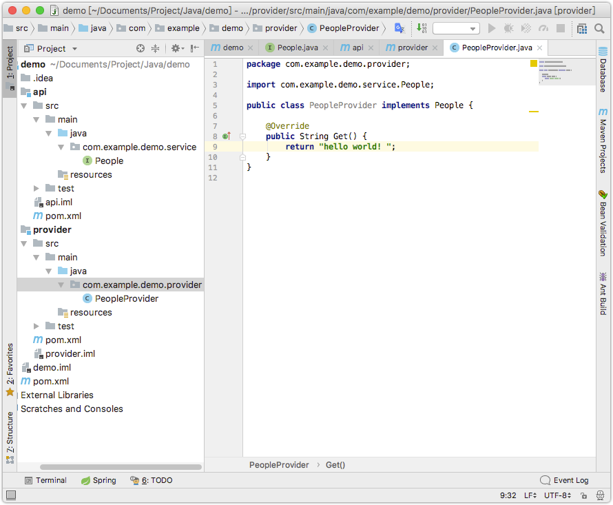

### 5. 添加其他配置文件

这里一共有两个配置文件需要添加

* people-provider.xml，spring配置
* log4j.properties，配置日志

**log4j.properties**
```yml
log4j.rootLogger=info, stdout
log4j.appender.stdout=org.apache.log4j.ConsoleAppender
log4j.appender.stdout.Target=System.out
log4j.appender.stdout.layout=org.apache.log4j.PatternLayout
log4j.appender.stdout.layout.ConversionPattern=[%d{dd/MM/yy hh:mm:ss:sss z}] %t %5p %c{2}: %m%n
```

**people-provider.xml**
```xml
<beans xmlns:xsi="http://www.w3.org/2001/XMLSchema-instance"
       xmlns:dubbo="http://code.alibabatech.com/schema/dubbo"
       xmlns="http://www.springframework.org/schema/beans"
       xsi:schemaLocation="http://www.springframework.org/schema/beans http://www.springframework.org/schema/beans/spring-beans-4.3.xsd
       http://code.alibabatech.com/schema/dubbo http://code.alibabatech.com/schema/dubbo/dubbo.xsd">

    <!-- provider's application name, used for tracing dependency relationship -->
    <dubbo:application name="canctrip-hotel-provider"/>

    <!-- use zookeeper registry center to export service -->
    <dubbo:registry address="zookeeper://127.0.0.1:2181"/>

    <!-- use dubbo protocol to export service on port 20880 -->
    <dubbo:protocol name="dubbo" port="20880"/>

    <!-- service implementation, as same as regular local bean -->

    <bean id="PeopleService" class="com.example.demo.provider.PeopleProvider"/>

    <!-- declare the service interface to be exported -->
    <dubbo:service interface="com.example.demo.service.People" ref="PeopleService"/>

</beans>
```

> 注意，这里的服务实现ID要和接口的ref对应

### 6. 暴露服务接口

在provider模块中创建main方法：

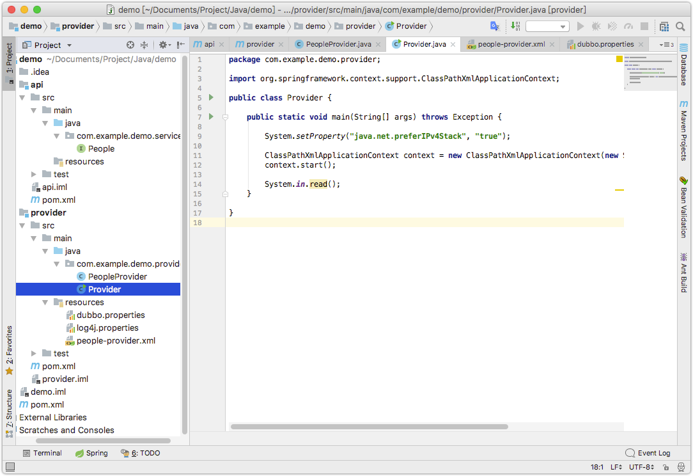

## 运行测试注册

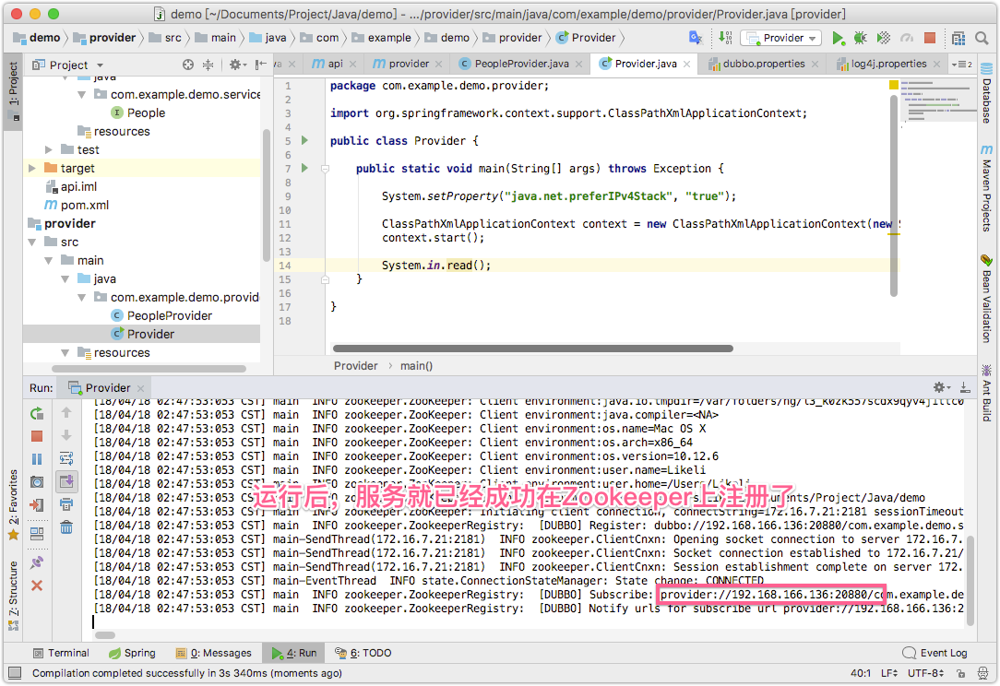

> 可以从图中的日志中看到，已经成功在zookeeper中注册了

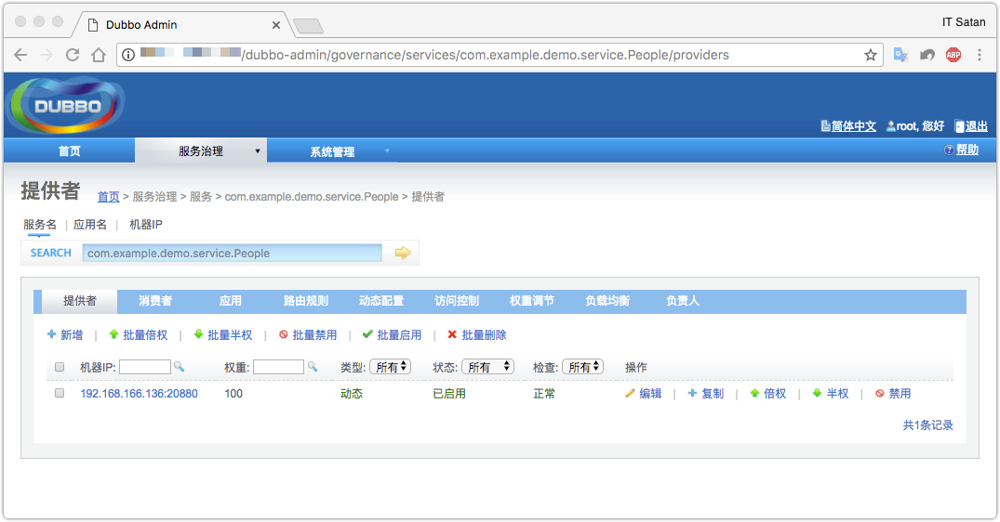

> 在注册中心看到这个服务已经上线了

消费服务
===

> [快速创建Dubbo基架](03.快速创建Dubbo基架)中已经讲解了服务提供者的创建，现在需要开始消费这些服务

## 创建消费者

### 1. 在上次的父模块中创建一个消费者子模块


### 2. 配置`pox.xml`

消费者模块也依赖api模块，所以需要引用api模块，然后添加dubbo的一些依赖：


完整配置:

```xml
<?xml version="1.0" encoding="UTF-8"?>
<project xmlns="http://maven.apache.org/POM/4.0.0"
         xmlns:xsi="http://www.w3.org/2001/XMLSchema-instance"
         xsi:schemaLocation="http://maven.apache.org/POM/4.0.0 http://maven.apache.org/xsd/maven-4.0.0.xsd">
    <parent>
        <artifactId>demo</artifactId>
        <groupId>com.example</groupId>
        <version>1.0-SNAPSHOT</version>
    </parent>
    <modelVersion>4.0.0</modelVersion>

    <artifactId>consumer</artifactId>
    <dependencies>
        <dependency>
            <groupId>com.example</groupId>
            <artifactId>api</artifactId>
            <version>1.0-SNAPSHOT</version>
        </dependency>

        <dependency>
            <groupId>com.alibaba</groupId>
            <artifactId>dubbo-config-spring</artifactId>
        </dependency>
        <dependency>
            <groupId>com.alibaba</groupId>
            <artifactId>dubbo-registry-zookeeper</artifactId>
        </dependency>
        <dependency>
            <groupId>com.alibaba</groupId>
            <artifactId>dubbo-registry-multicast</artifactId>
        </dependency>
        <dependency>
            <groupId>com.alibaba</groupId>
            <artifactId>dubbo-rpc-dubbo</artifactId>
        </dependency>
        <dependency>
            <groupId>com.alibaba</groupId>
            <artifactId>dubbo-remoting-netty</artifactId>
        </dependency>
        <dependency>
            <groupId>com.alibaba</groupId>
            <artifactId>dubbo-serialization-hessian2</artifactId>
        </dependency>
    </dependencies>
</project>
```

### 2. 添加其他配置文件

这里一共有两个配置文件需要添加

* services.xml，spring配置
* log4j.properties，配置日志

**services.xml**
 
 ```xml
<beans xmlns:xsi="http://www.w3.org/2001/XMLSchema-instance"
       xmlns:dubbo="http://code.alibabatech.com/schema/dubbo"
       xmlns="http://www.springframework.org/schema/beans"
       xsi:schemaLocation="http://www.springframework.org/schema/beans http://www.springframework.org/schema/beans/spring-beans-4.3.xsd
       http://code.alibabatech.com/schema/dubbo http://code.alibabatech.com/schema/dubbo/dubbo.xsd">

    <!-- consumer's application name, used for tracing dependency relationship (not a matching criterion),
    don't set it same as provider -->
    <dubbo:application name="canctrip-hotel-consumer"/>

    <!-- use zookeeper registry center to discover service -->
    <dubbo:registry address="zookeeper://127.0.0.1:2181"/>

    <!-- generate proxy for the remote service, then demoService can be used in the same way as the
    local regular interface -->
    <dubbo:reference id="PeopleService" check="false" interface="com.example.demo.service.People"/>

</beans>

 ```

### 3. 消费服务


> 从上图可以看到，接口调用成功


> 在管理中心，可以看到服务消费者和提供者都已经成功上线了