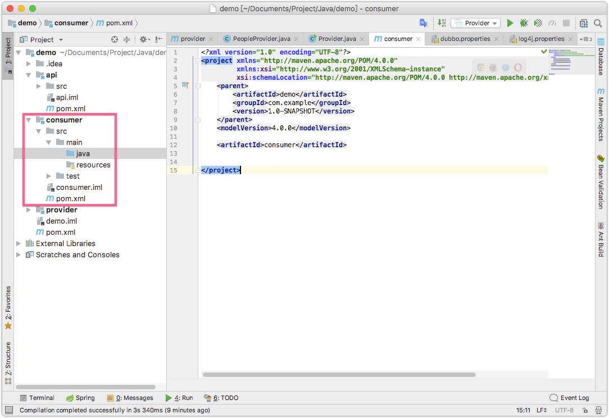
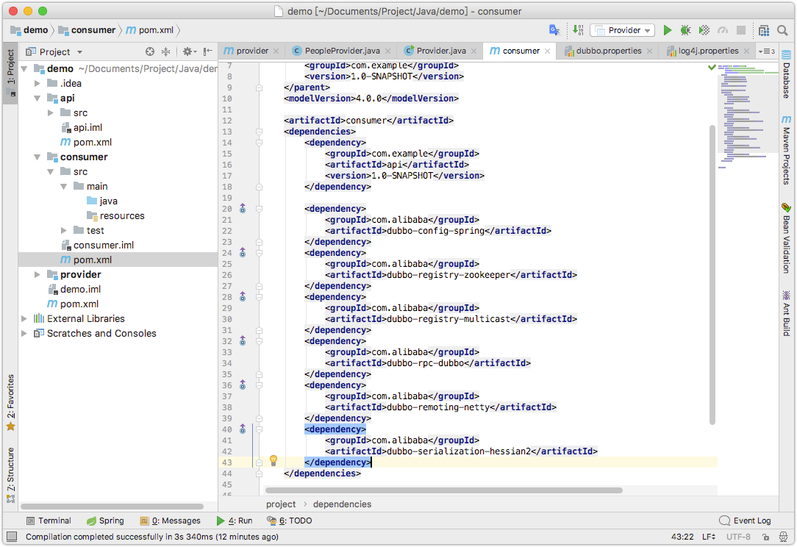
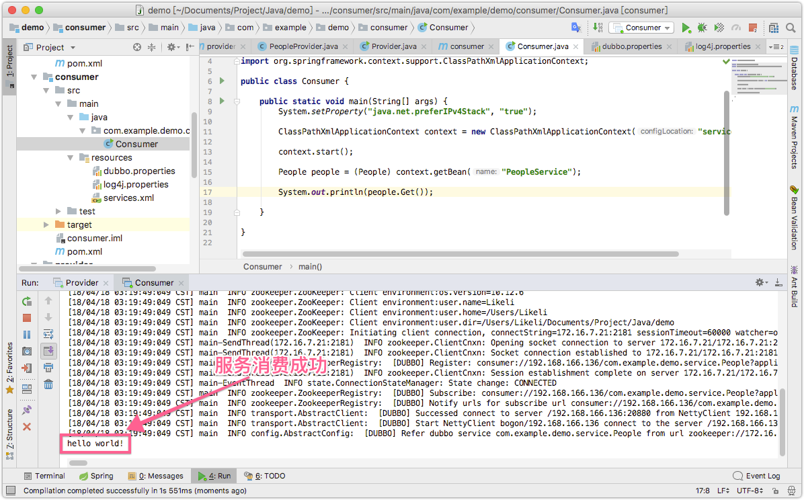
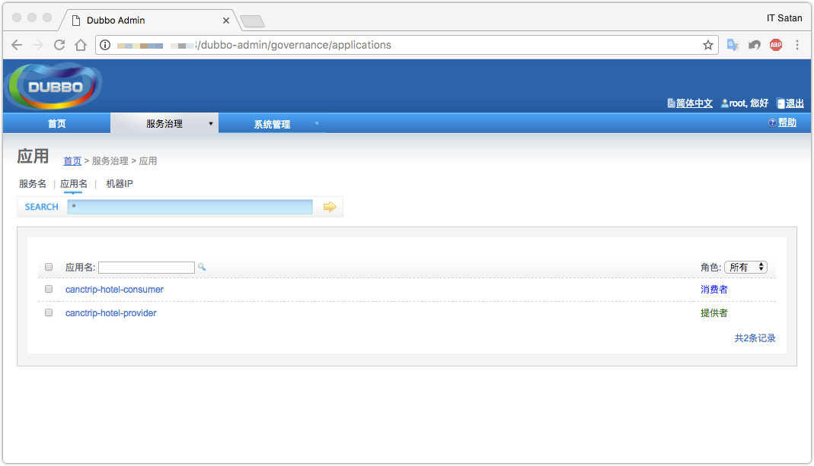

消费服务
===

> [快速创建Dubbo基架](03.快速创建Dubbo基架)中已经讲解了服务提供者的创建，现在需要开始消费这些服务

## 创建消费者

### 1. 在上次的父模块中创建一个消费者子模块



### 2. 配置`pox.xml`

消费者模块也依赖api模块，所以需要引用api模块，然后添加dubbo的一些依赖：



完整配置:

```xml
<?xml version="1.0" encoding="UTF-8"?>
<project xmlns="http://maven.apache.org/POM/4.0.0"
         xmlns:xsi="http://www.w3.org/2001/XMLSchema-instance"
         xsi:schemaLocation="http://maven.apache.org/POM/4.0.0 http://maven.apache.org/xsd/maven-4.0.0.xsd">
    <parent>
        <artifactId>demo</artifactId>
        <groupId>com.example</groupId>
        <version>1.0-SNAPSHOT</version>
    </parent>
    <modelVersion>4.0.0</modelVersion>

    <artifactId>consumer</artifactId>
    <dependencies>
        <dependency>
            <groupId>com.example</groupId>
            <artifactId>api</artifactId>
            <version>1.0-SNAPSHOT</version>
        </dependency>

        <dependency>
            <groupId>com.alibaba</groupId>
            <artifactId>dubbo-config-spring</artifactId>
        </dependency>
        <dependency>
            <groupId>com.alibaba</groupId>
            <artifactId>dubbo-registry-zookeeper</artifactId>
        </dependency>
        <dependency>
            <groupId>com.alibaba</groupId>
            <artifactId>dubbo-registry-multicast</artifactId>
        </dependency>
        <dependency>
            <groupId>com.alibaba</groupId>
            <artifactId>dubbo-rpc-dubbo</artifactId>
        </dependency>
        <dependency>
            <groupId>com.alibaba</groupId>
            <artifactId>dubbo-remoting-netty</artifactId>
        </dependency>
        <dependency>
            <groupId>com.alibaba</groupId>
            <artifactId>dubbo-serialization-hessian2</artifactId>
        </dependency>
    </dependencies>
</project>
```

### 2. 添加其他配置文件

这里一共有两个配置文件需要添加

* services.xml，spring配置
* log4j.properties，配置日志

**services.xml**
 
 ```xml
<beans xmlns:xsi="http://www.w3.org/2001/XMLSchema-instance"
       xmlns:dubbo="http://code.alibabatech.com/schema/dubbo"
       xmlns="http://www.springframework.org/schema/beans"
       xsi:schemaLocation="http://www.springframework.org/schema/beans http://www.springframework.org/schema/beans/spring-beans-4.3.xsd
       http://code.alibabatech.com/schema/dubbo http://code.alibabatech.com/schema/dubbo/dubbo.xsd">

    <!-- consumer's application name, used for tracing dependency relationship (not a matching criterion),
    don't set it same as provider -->
    <dubbo:application name="canctrip-hotel-consumer"/>

    <!-- use zookeeper registry center to discover service -->
    <dubbo:registry address="zookeeper://127.0.0.1:2181"/>

    <!-- generate proxy for the remote service, then demoService can be used in the same way as the
    local regular interface -->
    <dubbo:reference id="PeopleService" check="false" interface="com.example.demo.service.People"/>

</beans>

 ```

### 3. 消费服务



> 从上图可以看到，接口调用成功



> 在管理中心，可以看到服务消费者和提供者都已经成功上线了