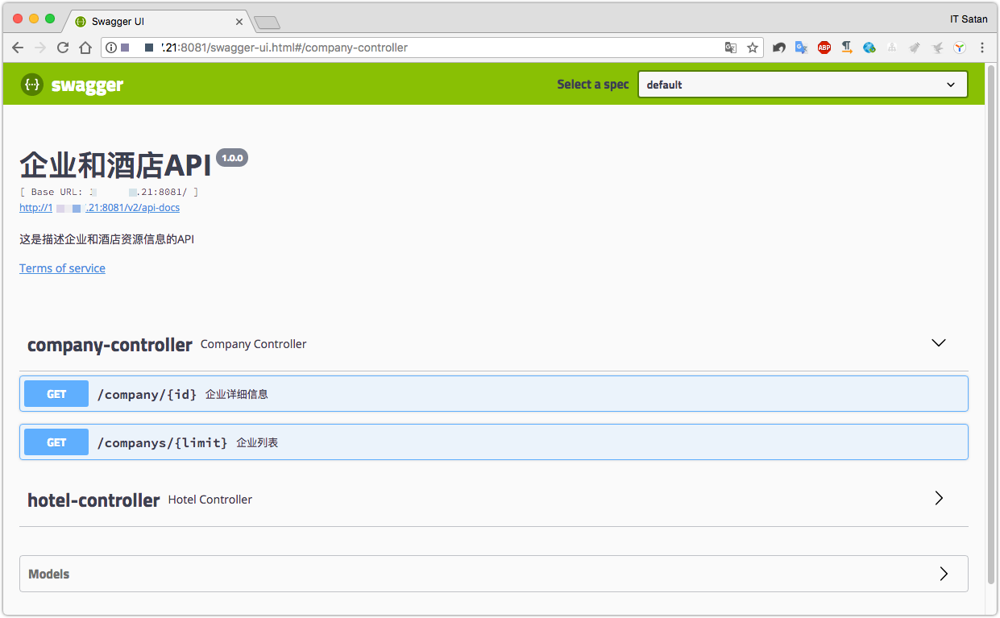

集成SwaggerUI
===

## 集成Swagger

为了更好的提供API的对接，选择使用Swagger来进行API的文档生产，在[Spring-bbot-dubber](Spring-bbot-dubber.md)的基础上进行集成。

## 增加Swagger依赖

在父包的`pox.xml`增加依赖声明：

```xml
<!-- swagger -->
<dependency>
    <groupId>io.springfox</groupId>
    <artifactId>springfox-swagger2</artifactId>
    <version>2.8.0</version>
</dependency>
<dependency>
    <groupId>io.springfox</groupId>
    <artifactId>springfox-swagger-ui</artifactId>
    <version>2.8.0</version>
</dependency>
<dependency>
    <groupId>javax.xml.bind</groupId>
    <artifactId>jaxb-api</artifactId>
    <version>2.3.0</version>
</dependency>
```

在`consumer-web`的`pom.xml`使用依赖：

```xml
 <!-- swagger -->
<dependency>
    <groupId>io.springfox</groupId>
    <artifactId>springfox-swagger2</artifactId>
</dependency>
<dependency>
    <groupId>io.springfox</groupId>
    <artifactId>springfox-swagger-ui</artifactId>
</dependency>
<dependency>
    <groupId>javax.xml.bind</groupId>
    <artifactId>jaxb-api</artifactId>
</dependency>
```

## 创建一个Swagger2.java，用来定义配置

> 定义依赖也可以在bean配置中完成，这里使用Java代码来定义配置

```java
import org.springframework.context.annotation.Bean;
import org.springframework.context.annotation.Configuration;
import springfox.documentation.builders.ApiInfoBuilder;
import springfox.documentation.builders.PathSelectors;
import springfox.documentation.builders.RequestHandlerSelectors;
import springfox.documentation.service.ApiInfo;
import springfox.documentation.spi.DocumentationType;
import springfox.documentation.spring.web.plugins.Docket;

@Configuration
public class Swagger2 {

    @Bean
    public Docket createRestApi() {
        return new Docket(DocumentationType.SWAGGER_2)
                .apiInfo(apiInfo())
                .select()
                .apis(RequestHandlerSelectors.basePackage("com.dubbo.test.controller"))
                .paths(PathSelectors.any())
                .build();
    }

    private ApiInfo apiInfo() {
        return new ApiInfoBuilder()
                .title("企业和酒店API")
                .description("这是描述企业和酒店资源信息的API")
                .termsOfServiceUrl("http://localhost/likeli/dubbo-boot-mybatis")
                .version("1.0.0")
                .build();
    }
}
```

## 在入口添加启动注解

```java
@EnableSwagger2
@SpringBootApplication
public class ClientApplication {
    public static void main(String[] args) {
        SpringApplication.run(ClientApplication.class, args);
    }
}
```

## 配置rest接口

```java
import com.alibaba.dubbo.config.annotation.Reference;
import com.jsj.dubbo.test.model.CompanyInfoTianyan;
import com.jsj.dubbo.test.service.CompanyService;
import io.swagger.annotations.ApiImplicitParam;
import io.swagger.annotations.ApiOperation;
import org.springframework.http.ResponseEntity;
import org.springframework.web.bind.annotation.PathVariable;
import org.springframework.web.bind.annotation.RequestMapping;
import org.springframework.web.bind.annotation.RequestMethod;
import org.springframework.web.bind.annotation.RestController;
import springfox.documentation.annotations.ApiIgnore;

import java.util.List;

@RestController
public class CompanyController {

    @Reference(version = "1.0.0")
    private CompanyService companyService;

    @ApiOperation(value = "企业详细信息", notes = "根据url的id来获取企业详细信息")
    @ApiImplicitParam(name = "id", value = "企业编号", required = true, dataType = "Integer", paramType = "path")
    @RequestMapping(value = "company/{id}", method = RequestMethod.GET)
    public ResponseEntity<CompanyInfoTianyan> get(@PathVariable(value = "id") Integer id) {

        return ResponseEntity.ok(companyService.Get(id));
    }

    @ApiOperation(value = "企业列表", notes = "获取企业列表")
    @ApiImplicitParam(name = "limit", value = "前多少条记录", required = true, dataType = "Integer", paramType = "path")
    @RequestMapping(value = "companys/{limit}", method = RequestMethod.GET)
    public ResponseEntity<List<CompanyInfoTianyan>> list(@PathVariable(value = "limit") int limit) {

        return ResponseEntity.ok(companyService.List(limit));
    }

    @ApiIgnore
    @RequestMapping(value = "/hi", method = RequestMethod.GET)
    public String jsonTest() {
        return " skip this ! ";
    }
}
```

## 运行，并访问

`http://localhost:8081/swagger-ui.html`

