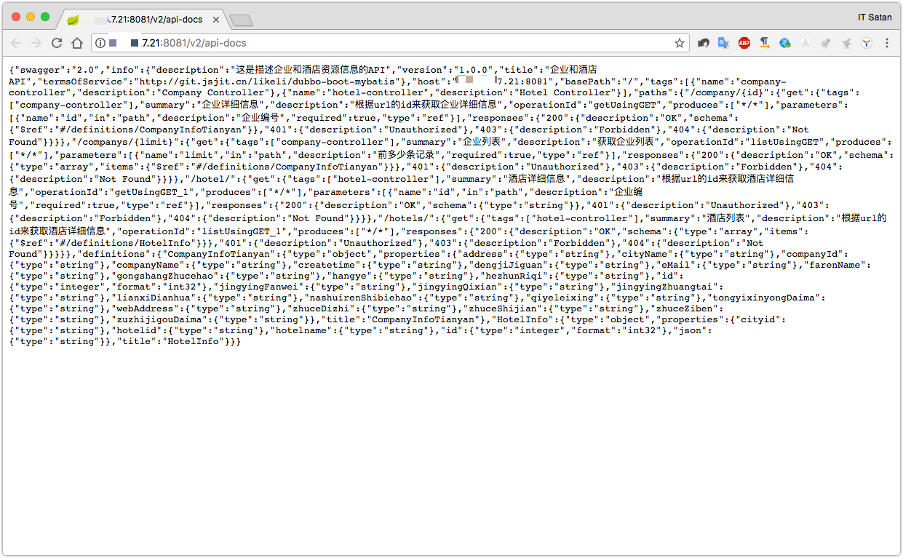
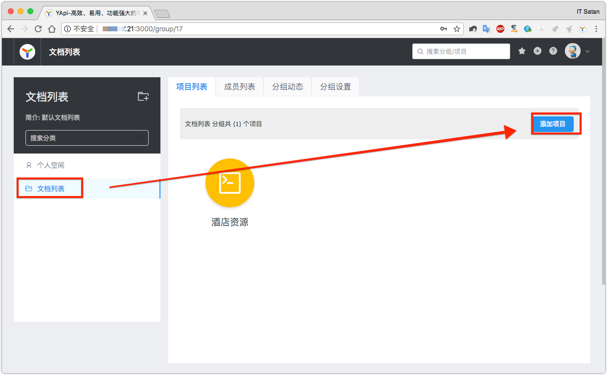
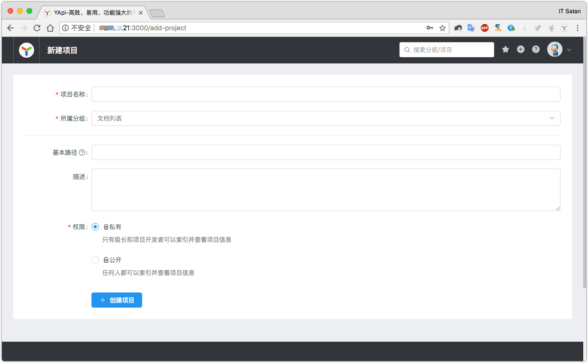
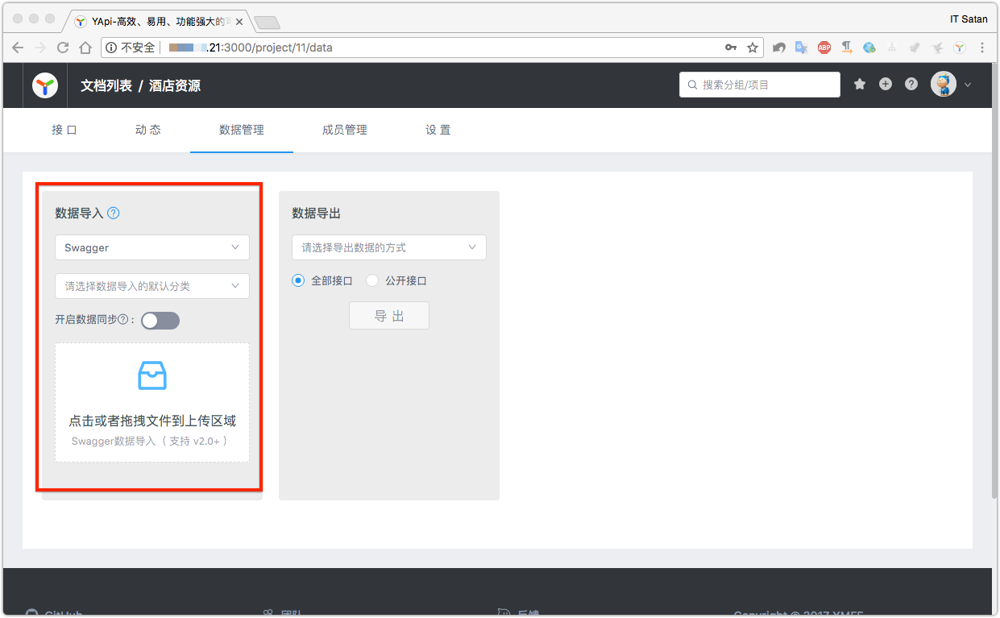
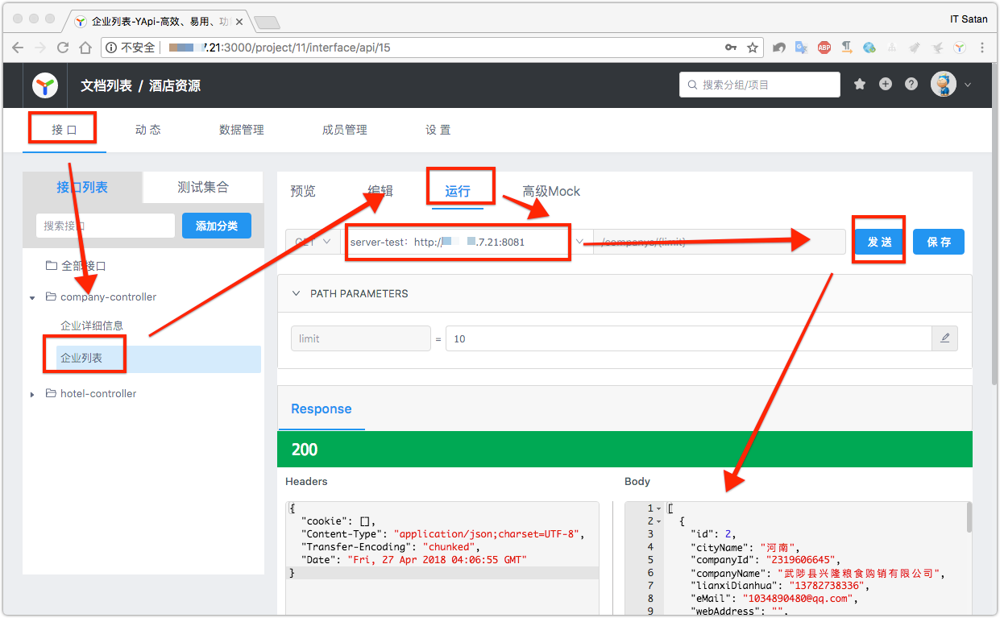

YAPI使用
===

## 配合Dubbo的使用

结合前面的`dubbo/集成swaggerUI`，已经得到了生产的swagger数据。现在需要把这些数据导入到YAPI中进行统一管理。

## 获取Swagger API数据

访问路径`http://localhost:8081/v2/api-docs`可以的到一个**json**结构的数据，保存下来。

## 使用YAPI

* 登录注册账号
* 创建新的项目
* 导入swagger数据
* 测试

> 这里导入swagger生产json文件即可。

### 测试接口

> YAPI的测试还是很简单的，不过需要根据提示安装一下Chrome的插件。

这样就可以进行简单的接口测试和文档查阅了，YAPI还提供了很多很丰富实用的功能，比如开发组设置，测试集合，Token，动态等等。