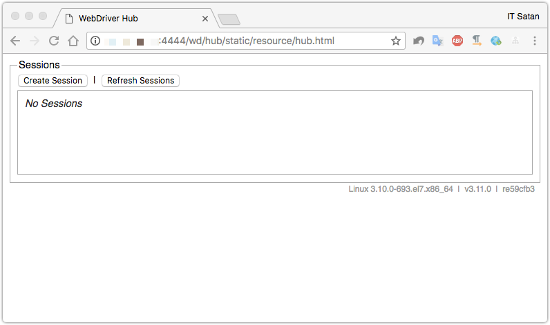
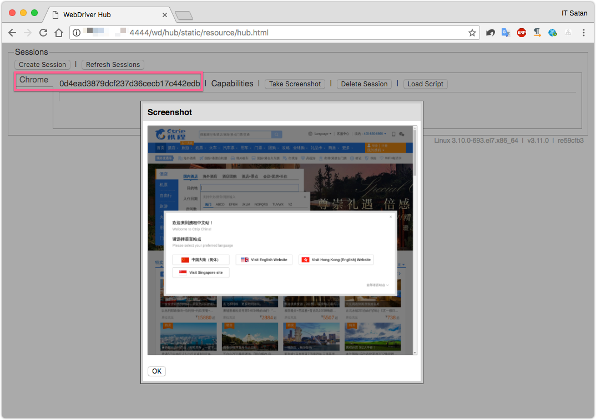

Selenium
===

> Selenium是一个用于Web应用程序测试的工具。Selenium测试直接运行在浏览器中，就像真正的用户在操作一样。

[官网](https://docs.seleniumhq.org)
[文档](http://selenium-python.readthedocs.io/getting-started.html#example-explained)


## 微服务中的用途

在微服务设计中，`Selenium`主要用来进行`Web 自动化测试`。另外，很多不需要很好性能的爬虫程序也会使用Selenium进行自动化采集，所以在很多需要web自动化的场景都可以使用`Selenium`

## 无头游览器

为了搭配`Selenium`进行自动化测试，提高效率，我们一般会使用无头游览器(headless browser)，也就是一种没有界面的游览器。这样既可以提高效率，也方便部署到Linux服务器。

> 以前使用较多的无头游览器是`PhantomJS`，但是自从Chrome开始支持headless模式，PhantomJS的作者也宣布停止更新PhantomJS了，所以目前大部分都选用Chrome的最新版来做自动化测试

集成`Selenium + Chrome + WebDriver`请自行Google。

## 无头游览器在Docker上部署

在服务器上安装游览器和相关驱动其实比较费劲，因为各种环境不一样会导致异常较多。所以通过Docker来部署是一个很好的选择。

成功实践过的一个Dockerfile：<https://store.docker.com/community/images/selenium/standalone-chrome>

这个Docker镜像能够快速的在服务器上不出一个`Chrome WebDriver Hub`环境，方便应用层进行远程操作。

### 实践过程

**1. 拉取最新的镜像**

```shell
docker pull selenium/standalone-chrome:3.11.0-californium
```

**2. 部署镜像**
```shell
docker run -d -p 4444:4444 --name chrome-webdriver selenium/standalone-chrome:3.11.0-californium
```

> 到这里，服务就运行成功了，可以访问`4444`端口的地址：`http://172.16.14.57:4444/wd/hub/static/resource/hub.html`，查看会话和快照，当然现在都是空的。



**3. 通过应用来远程访问WebDriver Hub，并进行业务操作**

> 我这里用python来编写应用层，进行演示

```python
from selenium import webdriver
from selenium.webdriver.common.desired_capabilities import DesiredCapabilities

driver = webdriver.Remote(
   command_executor='http://localhost:4444/wd/hub',
   desired_capabilities=DesiredCapabilities.CHROME)

driver.get("http://www.ctrip.com/")
```



> 可以看到，现在多了一个会话，且可以看到这个会话的快照和截图, 另外容器内的js也运行正常。

## 其他资料

Chrome WebDriver : <http://chromedriver.storage.googleapis.com/index.html>